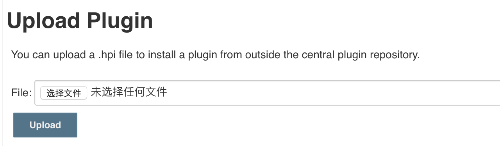
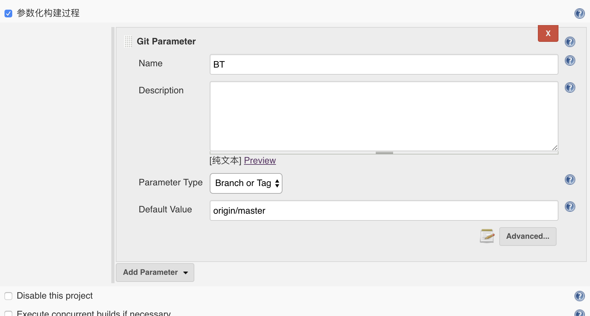
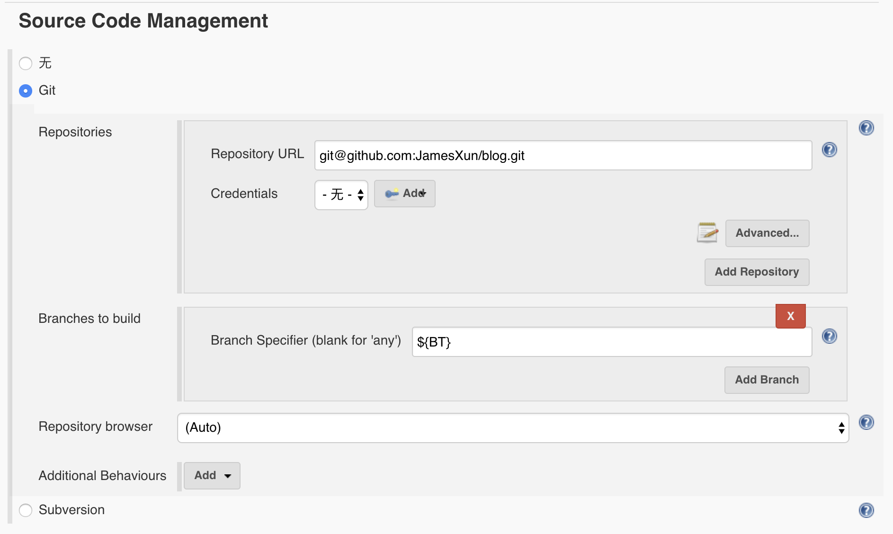
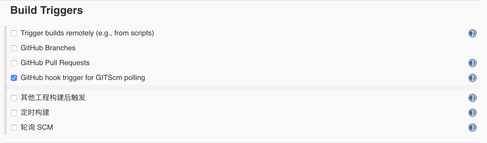
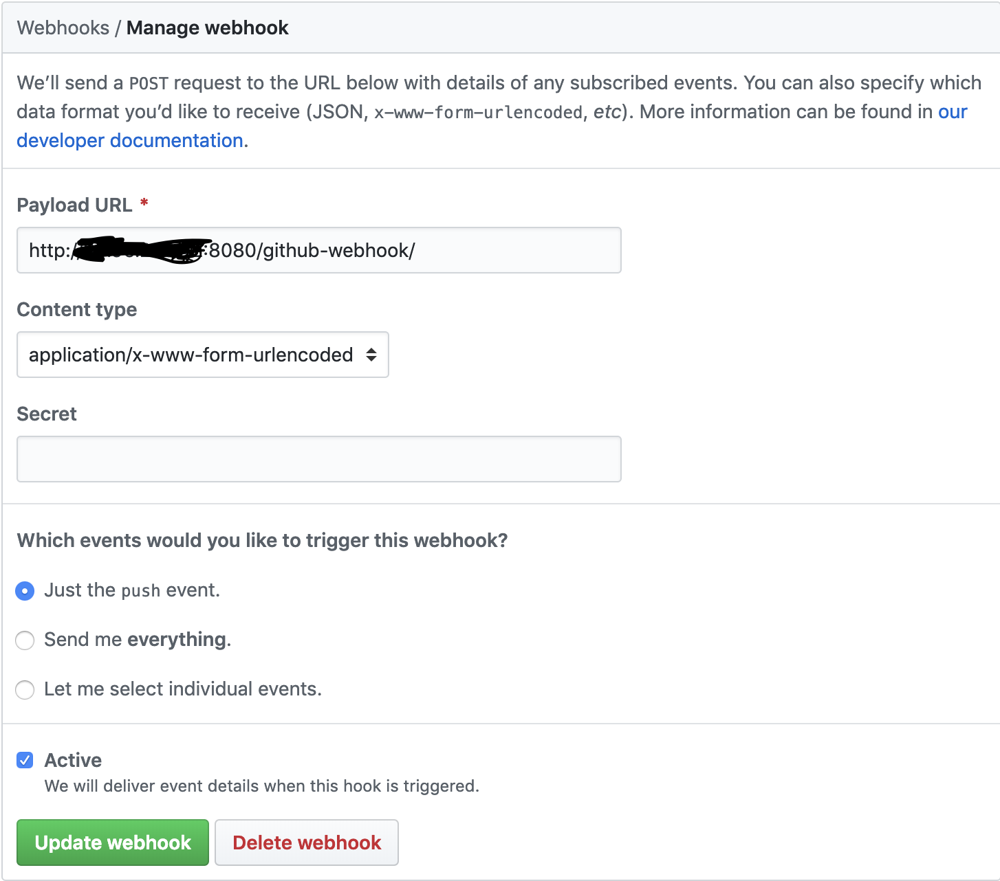

# 就从本博客开始

## 由来

最近阿里云搞活动，手痒，遂剁手尔买之。于是就有了部署本站的ECS（云服务器）。低配置高性价比，1核2G的U，40G点SSD，140元买了15个月的 ^_^（不是阿里云的广告啊，由于本人目前还未到25周岁，享受了24周岁以下自动获得学生身份的优惠政策~）。神说要有光 于是就有了光，我说要有博客（纯是因为有了台新服务器没处使劲儿），于是就有了这个博客。废话少说，上干货。

本站采用vuepress生成静态站点，Jenkins + GitHub hooks实现自动化部署，支持推送master自动发布、发布成功后自动推送tag到GitHub、手动发布（Branch or Tag）。已最方便的自动部署为前提，又实现了异常情况下的手动回滚或发布。

## 实现

真正的干货来了，没错，就是干的开裂那种~

::: tip 提示：
以下所有操作是基于CentOS 7.3系统的
:::

由于Jenkins是基于Java，所以我们先查看是否安装了Java

```bash
java -version
```

我的机器装了Java 如果你也一样 应该会出现如下提示：

```
openjdk version "1.8.0_201"
OpenJDK Runtime Environment (build 1.8.0_201-b09)
OpenJDK 64-Bit Server VM (build 25.201-b09, mixed mode)
```

如果没装Java的同学自行Google yum 安装 Java 就行了，非常方便
好的，现在我们可以安装Jenkins。没错，还是用yum。Because i like it

::: tip 提示：
Jenkins官网最新稳定版：[https://pkg.jenkins.io/redhat-stable/](https://pkg.jenkins.io/redhat-stable/?_blank)
:::

下载依赖

```bash
sudo wget -O /etc/yum.repos.d/jenkins.repo https://pkg.jenkins.io/redhat-stable/jenkins.repo
```

导入秘钥

```bash
sudo rpm --import https://pkg.jenkins.io/redhat-stable/jenkins.io.key
```

安装Jenkins

```bash
yum install jenkins
```

接下来我们找到Jenkins的安装路径

```bash
rpm -ql jenkins
```

输出如下

```
/etc/init.d/jenkins
/etc/logrotate.d/jenkins
/etc/sysconfig/jenkins
/usr/lib/jenkins
/usr/lib/jenkins/jenkins.war // 这个就是Jenkins的安装路径
/usr/sbin/rcjenkins
/var/cache/jenkins
/var/lib/jenkins
/var/log/jenkins
```

Jenkins默认8008端口 查看其他端口占用情况

```bash
netstat -ntlp
```

输出如下

```
Active Internet connections (only servers)
Proto Recv-Q Send-Q Local Address           Foreign Address         State       PID/Program name    
tcp        0      0 0.0.0.0:8080            0.0.0.0:*               LISTEN      5172/java           
tcp        0      0 0.0.0.0:80              0.0.0.0:*               LISTEN      4967/nginx: master  
tcp        0      0 0.0.0.0:22              0.0.0.0:*               LISTEN      2037/sshd           
```

如果未占用8080端口 直接启动jenkins

```bash
java -jar /usr/lib/jenkins/jenkins.war
```

如果希望后台不间断运行 请使用nohup + &

```bash
nohup java -jar /usr/lib/jenkins/jenkins.war &
```

验证jenkins

浏览器输入 `http://ip:port` （例如 `http://192.168.114.128:8080`）进入jenkins解密界面

获取密码
```bash
cat /var/lib/jenkins/secrets/initialAdminPassword
```

其余操作

- 输入密码 => 继续
- 安装插件
- 注册账号 (记好账号密码，因为是root账号)
- 开始使用Jenkins

接下来就是创建Job并配置

首先想要根据 `Branch or Tag` 来发布就必须要装一个叫 `Git Parameter Plugin` 的插件

hmmm 网上超级多资料 但是轮到我下载的时候 才发现在Jenkins的可用插件里压根根本找不到这货 T T

天无绝人之路 果然在[GitHub](https://github.com/jenkinsci/git-parameter-plugin/?_blank)上找到了这个插件

然后使用骚操作 找到 `Advanced` 里的 `Upload Plugin` 上传即可



ta da ~ 插件安装完毕 继续愉快的玩耍

找到 `General` 填写项目url（git仓库地址）参数化构建过程新增一个 `Git Parameter` 类型的

`Name` 是变量名 等下要用到，`Parameter Type` 选 `Branch or Tag`，`Default Value` 这里我填了origin/master 因为要推送时候自动部署master分支



之后设置 `Source Code Management` 主要是 `Branches to build` 里的 `Branch Specifier` 这个说明符要填之前 `Name`



重点来了 `Build Triggers` 是实现自动部署的核心配置 要勾选 `GitHub hook trigger for GITScm polling`



勾选这里意味着订阅了 `GitHub hook` 来触发我们job的构建，让我们移步到GitHub Settings的Webhooks 来添加钩子 点击 Add webhook 地址是我们Jenkins接收GitHub webhooks 的地址



当然你也可以尝试其他钩子 这里只需要master的push钩子 之后我们配置好nginx、job中的构建命令即可完成本站类型的构建啦~

